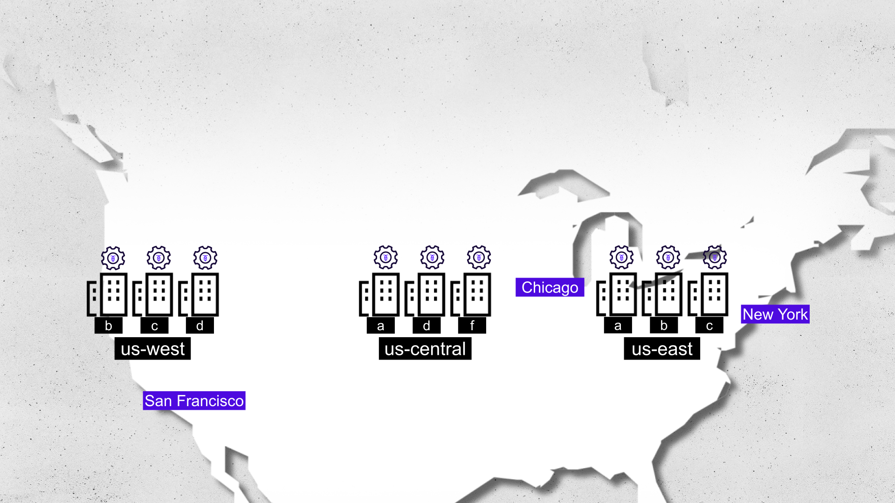

# Create a Multi-region Database

## Objectives

In this challenge you will:
- Create a multi-region database
- Observe how replicas are impacted by using multi-region abstractions
- Learn how to add and manage multiple regions in CockroachDB


## The Story
===

MovR, a vehicle-sharing company, currently runs their CockroachDB cluster in a single region - "**us-east**." Whenever their cloud provider experiences an outage in this region, MovR experiences an outage. Additionally, users who don't live near this region experience slow responses from the MovR application. The team wants to improve response times by moving some data closer to users outside of us-east and improve resilience by having data in more than one region.

CockroachDB multi-region capabilities can help MovR achieve their resilience and latency goals.



## Starting Point

You have access to a CockroachDB cluster running with nodes across three regions: `us-east`, `us-central`, and `us-west`. The MovR application databases are already loaded.

## Steps

### 1. Review the Current Environment
===

1. Connect to the cluster:

```bash,run
cockroach sql --certs-dir=/root/certs --host=haproxy
```

2. Start by examining the current database setup:

```sql,run
SHOW DATABASES;
```

You should see three MovR databases in the output:
- movr_rides
- movr_users
- movr_vehicles

Note that initially, the `primary_region`, `regions`, and `survival_goal` columns will all be NULL or empty sets {}.

### 2. Examine Current Range Distribution
===

Before applying multi-region configurations, let's look at how replicas are currently distributed:

```sql,run
with range_info AS (SHOW RANGES FROM TABLE movr_rides.rides WITH DETAILS)
SELECT range_id,lease_holder,lease_holder_locality,replicas,replica_localities from range_info;
```

Take note of:
- The lease_holder node id (This will be a node id ranging from 1 - 9)
- The lease_holder_locality
- Node ids for all replicas (Replicas should be present on 3 different nodes)
- The replica_localities

### 3. Configure the Primary Region
===

Since the majority of MovR's users are in New York City, set us-east as the primary region for the movr_rides database:

```sql,run
ALTER DATABASE movr_rides SET PRIMARY REGION "us-east";
```

Verify the change:
```sql,run
SHOW REGIONS FROM DATABASE movr_rides;
```

At this point, all replicas should move to a single region, `us-east`. Verify that with the following command:
```sql,run
with range_info AS (SHOW RANGES FROM TABLE movr_rides.rides WITH DETAILS)
SELECT range_id,lease_holder,lease_holder_locality,replicas,replica_localities from range_info;
```

> [!NOTE]
> It could take up to a minute to see the leaseholder location change.

### 4. Add Additional Regions
===

Add two more regions to create a fully distributed setup:

1. Add the `us-central` region:

```sql,run
ALTER DATABASE movr_rides ADD REGION "us-central";
```

2. Wait a few moments and verify the changes with:
```sql,run
with range_info AS (SHOW RANGES FROM TABLE movr_rides.rides WITH DETAILS)
SELECT range_id,lease_holder,lease_holder_locality,replicas,replica_localities from range_info;
```

You should notice:
- Some replicas now present in the new region
- Each range should have 4 replicas instead of 3

3. Now add the third region, `us-west`:
```sql,run
ALTER DATABASE movr_rides ADD REGION "us-west";
```

4. Check the final distribution with all three regions added:
```sql,run
with range_info AS (SHOW RANGES FROM TABLE movr_rides.rides WITH DETAILS)
SELECT range_id,lease_holder,lease_holder_locality,replicas,replica_localities from range_info;
```

You should now see:
- Replicas spread across all three regions
- Five replicas per range

5. Take a final look at the `SHOW REGIONS` table:

```sql,run
SHOW REGIONS FROM DATABASE movr_rides;
```

You should see the following:
```nocopy
   database  |   region   | primary | secondary |  zones
-------------+------------+---------+-----------+----------
  movr_rides | us-east    |    t    |     f     | {a,b,c}
  movr_rides | us-central |    f    |     f     | {a,b,c}
  movr_rides | us-west    |    f    |     f     | {a,b,c}
```

## Success Criteria
===

You have successfully completed this challenge when:
1. The movr_rides database has us-east configured as its primary region
2. Two additional regions (us-central and us-west) are added to the database
3. Running `SHOW RANGES` shows replicas distributed across all three regions

## Summary
===

- CockroachDB optimizes access to the database's data from the primary region
- Adding regions automatically triggers replica redistribution
- The number of replicas increases as you add regions to ensure resilience
- Replicas are automatically distributed across regions for improved availability

> [!NOTE]
> Remember: Distributing your data across at least 3 regions is a fundamental step in building a highly resilient multi-region database.
